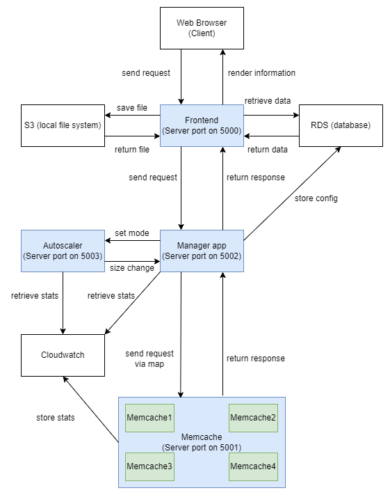

# ECE1779_Group22_a1

## Project description
This project is a simple application that allows users to upload and retrieve images with cache. 
The user can upload a image to store into the cache with a unique key and the image will be stored into local file system as well as database.
The user can also retrieve images with a specific key, and the images will be retrieved from cache or local file system depending on whether they are in the cache or not.
Different cache configuration can be changed to meet user's need and the statistics of the cache will be displayed upon request. 


## General Architecture


The diagram above shows that general architecture of our application. 
The frontend and the memcache highlighted in blue are the two Flask instances in our application. 
Generally, the web browser sends requests to the frontend. 
The frontend as a server will first manipulate the requests and send the requests to memcache for further process. 
After receiving the requests, memcache, as a server, communicates with the database if saving statistics is necessary and returns responses back to the frontend. 
According to the responses sent back from memcache, frontend will determine whether it is needed to interact with the database to retrieve data such as images’ path and memcache’s statistics or interact with the local file system to save images etc. 
Finally, after all communications end, the frontend will render the information the client needs and display it on the browser.


## Run the application
```
start.sh
```

